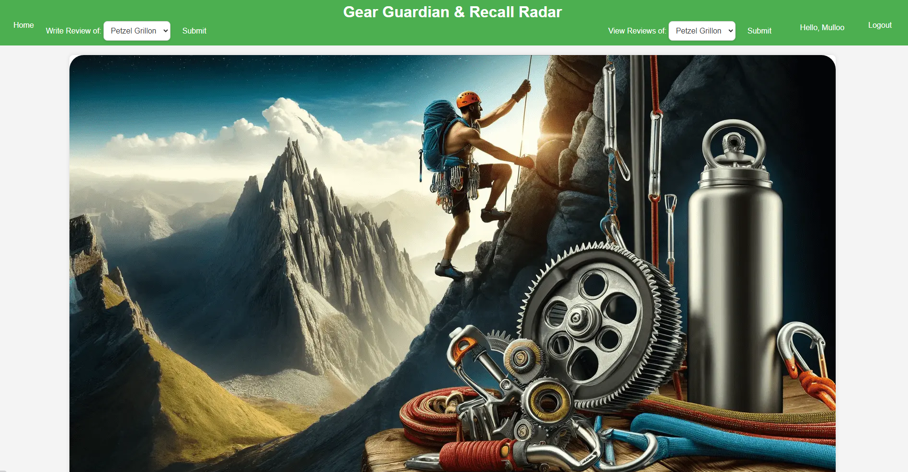
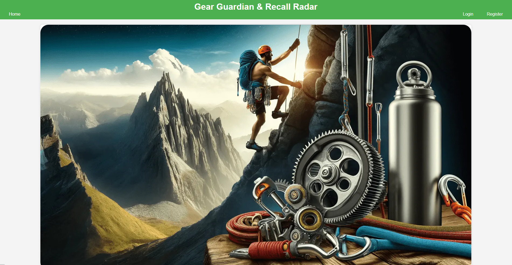
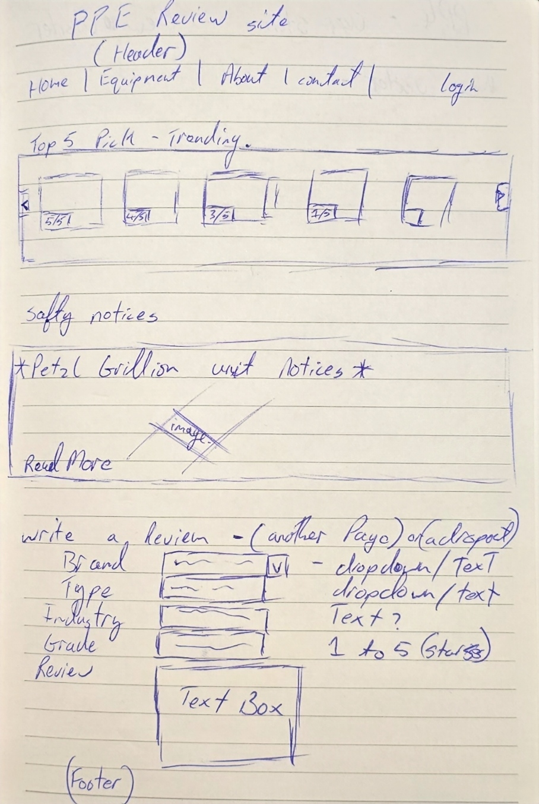
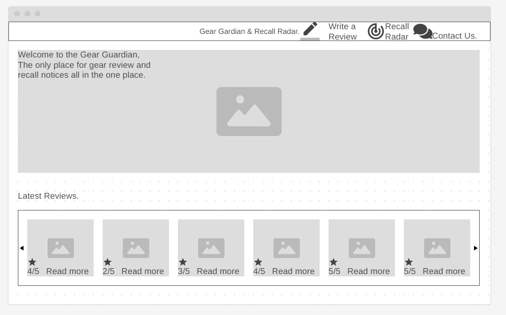
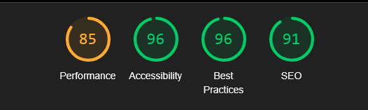

# Gear Guardian & Recall Radar

Gear Guardian and Recall Radar is a site for Climbing Personal Protective Equipment reviews as well as a place to find any manufacturer safety notices or equipment recalls.

[Live Site](https://gear-guardian-3e31e683d207.herokuapp.com/)





---

## Features

- **User Registration**: Users can create an account to access personalized features.
- **Login/Logout**: Secure authentication for users.
- **Browse Reviews**: Users can browse a list of product reviews.
- **Recall Details**: Detailed information about each recall currently done through reviews by manufacture role.
- **Admin Dashboard**: Admins can manage recalls and user accounts.
- **CRUD Operations**: Admins can create, read, update, and delete recalls.

---

## Wireframes

- 

- 

## Technologies used

- ### Languages

  - [Python 3.8.5](https://www.python.org/downloads/release/python-385/): the primary language used to develop the server-side of the website.
    - [JS](https://www.javascript.com/): the primary language used to develop interactive components of the website.
    - [HTML](https://developer.mozilla.org/en-US/docs/Web/HTML): the markup language used to create the website.
    - [CSS](https://developer.mozilla.org/en-US/docs/Web/css): the styling language used to style the website.

- ### Frameworks and libraries

  - [Django](https://www.djangoproject.com/): python framework used to create all the logic.
    - [jQuery](https://jquery.com/): was used to control click events and sending AJAX requests.
    - [jQuery User Interface](https://jqueryui.com/) was used to create interactive elements.

- ### Databases

  - [SQLite](https://www.sqlite.org/): was used as a development database.
    - [PostgreSQL](https://www.postgresql.org/): the database used to store all the data.

- ### Other tools

  - [Git](https://git-scm.com/): the version control system used to manage the code.
    - [Pip3](https://pypi.org/project/pip/): the package manager used to install the dependencies.
    - [Gunicorn](https://gunicorn.org/): the web server used to run the website.
    - [Psycopg2](https://www.psycopg.org/): the database driver used to connect to the database.
    - [Django-allauth](https://django-allauth.readthedocs.io/en/latest/): the authentication library used to create the user accounts.
    - [Django-crispy-forms](https://django-cryptography.readthedocs.io/en/latest/): was used to control the rendering behavior of Django forms.
    - [Render](https://pypi.org/project/render/): was used to render the README file.
    - [GitHub](https://github.com/): used to host the website's source code.
    - [VSCode](https://code.visualstudio.com/): the IDE used to develop the website.
    - [Chrome DevTools](https://developer.chrome.com/docs/devtools/open/): was used to debug the website.
    - [Font Awesome](https://fontawesome.com/): was used to create the icons used in the website.
    - [Draw.io](https://www.lucidchart.com/) was used to make a flowchart for the README file.
    - [Coolors](https://coolors.co/202a3c-1c2431-181f2a-0b1523-65e2d9-925cef-6b28e0-ffffff-eeeeee) was used to make a color palette for the website.

### Manual Testing

Manual testing was performed to ensure the application works as expected from a user's perspective. This includes testing the user interface, navigation, and overall user experience.

| Test Case ID | Test Description | Steps to Execute | Expected Result | Actual Result | Pass/Fail |
|--------------|------------------|------------------|-----------------|---------------|-----------|
| TC01         | User Registration | 1. Navigate to the registration page. 2. Fill in the registration form with valid data. 3. Submit the form. | User account is created, and a success message is displayed. | As Expected | Pass |
| TC02         | User Login | 1. Navigate to the login page. 2. Enter valid username and password. 3. Submit the form. | User is logged in and redirected to the home page. | As Expected  | Pass |
| TC03         | User Logout | 1. Log in as a user. 2. Click on the logout button. | User is logged out and redirected to the login page. | As Expected | Pass |
| TC04         | Browse Recalls | 1. Log in as a user. 2. Navigate to the recalls page. | List of product recalls is displayed. | As Expected | Pass |
| TC05         | Search Recalls | 1. Log in as a user. 2. Navigate to the recalls page. 3. Enter a search term in the search bar. 4. Submit the search. | Recalls matching the search term are displayed. | As Expected | Pass |
| TC06         | View Recall Details | 1. Log in as a user. 2. Navigate to the recalls page. 3. Click on a recall to view details. | Detailed information about the recall is displayed. | As Expected | Pass |
| TC07         | Admin Add Recall | 1. Log in as an admin. 2. Navigate to the admin dashboard. 3. Click on "Add Recall". 4. Fill in the recall form with valid data. 5. Submit the form. | Recall is added, and a success message is displayed. | As Expected | Pass |
| TC08         | Admin Edit Recall | 1. Log in as an admin. 2. Navigate to the admin dashboard. 3. Click on a recall to edit. 4. Update the recall details. 5. Submit the form. | Recall is updated, and a success message is displayed. | As Expected | Pass |
| TC09         | Admin Delete Recall | 1. Log in as an admin. 2. Navigate to the admin dashboard. 3. Click on a recall to delete. 4. Confirm the deletion. | Recall is deleted, and a success message is displayed. | As Expected | Pass |
| TC10         | Receive Notifications | 1. Log in as a user. 2. Subscribe to notifications. 3. Admin adds a new recall. | User receives an email notification about the new recall. | As Expected  | Pass |

### User Stories

#### First Time Visitor

| User Story |
|-------------|
|As a First Time Visitor, I want to be able to register my account, so that I can learn the benefits of the app as a user. |
|As a First Time Visitor, I want to be able to easily understand the main purpose of the app, so that I can learn more about this app. |
|As a First Time Visitor, I want to be able to easily navigate through the app, so that I can find the content. |
|As a First Time Visitor, I want to be informed clearly if I am making any errors when registering my account, so that I can be able to fix any errors quickly if I make some. |

#### Regular User

| User Story |
|-------------|
|As a Regular User, I want to be able to access my account without having to log in every time, so that I can quickly check for new recalls. |
|As a Regular User, I want to be sure that my account details are protected, so that I can safely use the website. |
|As a Regular User, I want to be able to view my data, so that I can easily check my account details and past notifications. |
|As a Regular User, I want to be able to search for a recall, so that I can find specific recall information. |
|As a Regular User, I want to be able to sort recalls by category, so that I can find the most relevant recalls. |
|As a Regular User, I want to be able to receive notifications about new recalls, so that I can stay informed. |

#### Admin

| User Story |
|-------------|
|As an Admin, I want to be able to add, edit, and delete recalls, so that I can keep the recall information up to date. |
|As an Admin, I want to be able to manage user accounts, so that I can ensure the security and integrity of the website. |
|As an Admin, I want to be able to send notifications to users, so that I can inform them about new recalls. |

---

## Deployment

The project was deployed using **Heroku**, Below are the steps taken to deploy:

### Deployment Steps

1. **Set up a new Heroku app** and link to the GitHub repository.
2. **Add PostgreSQL database** and configure environment variables for production.
3. **Set environment variables** such as `SECRET_KEY`, `DATABASE_URL`, and `COLLECT_STATIC`
4. **Run migrations** and collect static files using `python manage.py migrate` and `python manage.py collectstatic`.
5. **Deploy the app** via Heroku’s GitHub integration and automated deployment pipeline.

---

## ERD

```plaintext
+------------------+       +------------------+       +------------------+
|      User        |       |    Equipment     |       |      Review      |
+------------------+       +------------------+       +------------------+
| - id: UUID       |       | - id: UUID       |       | - id: UUID       |
| - username: str  |       | - name: str      |       | - review_text: str|
| - email: str     |       | - description: str|      | - rating: int    |
| - password: str  |       | - manufacturer: str|     | - created_at: datetime|
| - is_admin: bool |       | - created_at: datetime|  | - updated_at: datetime|
|                  |       | - updated_at: datetime|  | - user_id: UUID  |
+------------------+       +------------------+       | - equipment_id: UUID|
  |                          |                          |
  |                          |                          |
  |                          |                          |
  +--------------------------+--------------------------+
           |
           |
           |
        +------------------+
        |   Manufacturer   |
        +------------------+
        | - id: UUID       |
        | - name: str      |
        | - created_at: datetime|
        | - updated_at: datetime|
        +------------------+
```

---

## Lighthouse Report



---

## Credits

- The login and Registration system for this site is from the following [Video](https://www.youtube.com/watch?v=tUqUdu0Sjyc&t=1938s)

---

## Acknowledgments

- I have to take the time to thank my mentor for all the help and support during this project

---
